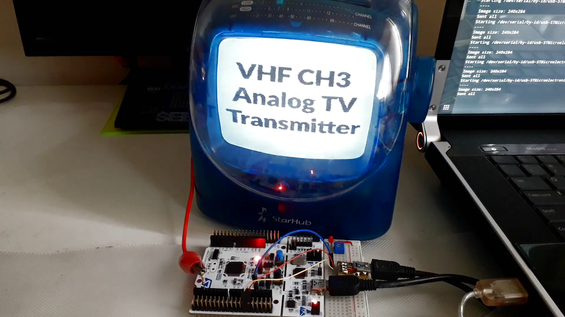

# PAL-Streamer

Transmit a video stream to a PAL analog TV using low-frequency PWM

Analog TV PAL CH3 transmitter

### Documentations

Visit my Hackaday project for explanation how it works

- https://hackaday.io/project/171977-pal-streamer

### STM32 Firmware

Pinout for STM32F411 Nucleo Board.

	PA12 (CN10_12) to USB DP
	PA11 (CN10_14) to USB DM
	PA10 (D2) to antenna

Add path to the STM32CubeMX HAL drivers and Compile with STM32CubeIDE.

### PC Software

Connect board to the PC using USB CDC Virtual COM Port.

Run Python 3 program.

	python3 usart_new.py <COM_PORT> <IMAGE_FILE> <GIF_DELAY>
	python3 usart_new.py COM2 example.png
	python3 usart_new.py /dev/tty.usb* example.png

### TV Specs

Standard: PAL-B/G

Frequency: VHF CH 2-12, UHF CH 21-69

Connector: Aerial connector

### Video carrier frequency

VHF LOW

- CH2 = 55.25 MHz
- CH3 = 61.25 MHz
- CH4 = 67.25 MHz
- CH5 = 77.25 MHz
- CH6 = 83.25 MHz

VHF HIGH

- CH7 = 175.25 MHz
- ...
- CH12 = 205.25 MHz
- CH13 = 211.25 MHz

### PAL/NTSC Timing Specification

- http://www.kolumbus.fi/pami1/video/pal_ntsc.html
- http://martin.hinner.info/vga/pal.html
- http://martin.hinner.info/vga/
- http://www.batsocks.co.uk/readme/video_timing.htm
- https://www.mups.co.uk/post/2017/07/non-interlaced-pal-video/
- https://www.rigacci.org/docs/biblio/online/pal_video/
- http://wiki.americanarchive.org/index.php/Breakdown_of_Analog_Broadcast_Standards
- https://forum.videohelp.com/threads/393870-Help-me-to-understand-the-NTSC-signal-fields
